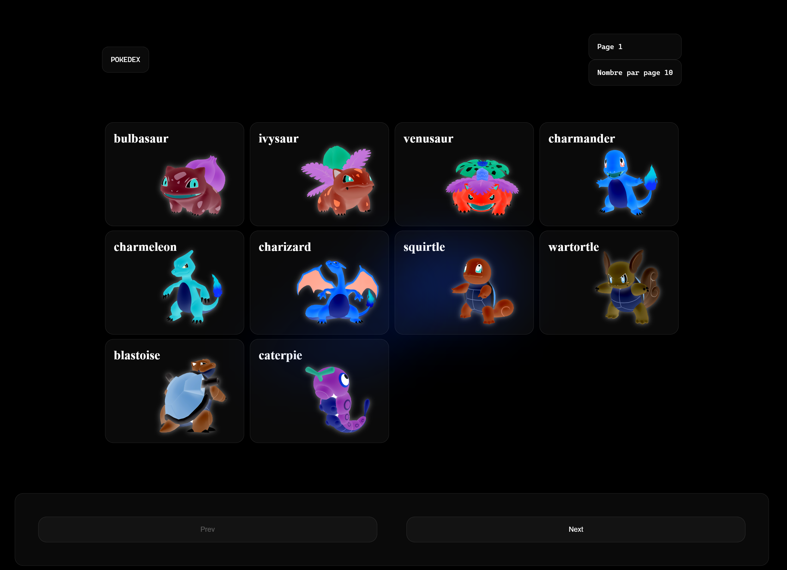

# poke-bundle

Pokemon bundle  server and client side rendering with Next.js to consume the [PokeAPI](https://pokeapi.co/).

## Getting Started

## client side rendering
repository: [PokeDex]

    ```bash
    cd pokedex
    yarn install
    yarn start:dev
    ```

## Built With
Open [http://localhost:3000](http://localhost:3000) with your browser to see the result.


## Server side rendering

# PokeApi URL
    https://pokeapi.co/api/v2

# Prerequisites

### Run Locally
If you want to setup locally this server, you need the following.

    - Nodejs (V14.x)
    - yarn (v1.x)
    - Mongo database
    - A Client to test it

modify the .env file with your own database credentials, then run the following commands:
```
{
    NODE_NAME=""
    PORT=3001
    MONGO_CONNECTION_STRING=""
    DB_NAME="pokedex"
    POKE_API_BASE_URL=""
}
```
For the server side rendering, you need to run the server from Nestjs framework from pokeapi directory.
repository: [PokeAPI]

## Built With
Open [http://localhost:3000](http://localhost:3001) with your browser to see the result.

    ```bash
    cd pokeapi
    yarn install
    yarn start:dev
    ```


# User stories & endpoints

## ```/api/pokemons/{offset}/{limit}``` GET
```
As a guest user,
So I can list all pokemon paginated,
offset: number of pokemon to skip
limit: number of pokemon to return
and filled the bd when it didnt find in the bd, go to the pokeapi and save it in the bd
I would like to be able to list them
```

## ```/pokemon/{id}``` GET
```
As a guest user,
So I can get a pokemon,
I would like to be able to get it by ID
```

# Technologies

```
- Hexagonal Arch
- Nestjs
- Node, typescript
- JSON
- Mongo DB
- Git / Github
- ESlint
```

screen 




Si 5 devs rejoignent ton équipe demain et que ton application est en production, 
quelles sont les améliorations à apporter à l'environnement de Dev et pourquoi ?


cloisoné  les acces au differentes ressources 
-  mettre en place un serveur de cache pour les ressources statiques
- optimiser de test pour les tests unitaires et fonctionnels et optimisation des tests
- optimiser le  déploiement pour le déploiement de l'application et de la base de données
- serveur de build pour la construction de l'application 
-  mettre en place des replicats de base de donnée pour les tests
- serveur de monitoring pour les métriques de l'application et de la base de données
- 

